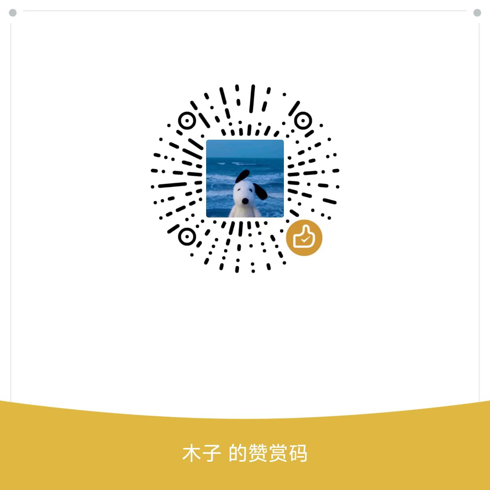

> **Statement:** This project is for traditional folk culture entertainment and WebGIS practice only. Analysis quality depends on the DEM dataset uploaded to Cesium, river/water data, and local GIS data quality. Support is welcome. For questions, please open an Issue or contact: `lm1248571@gmail.com`.

# Shanshui Mingtang Feng Shui GIS


**Language:** English | [中文](#中文说明)

Shanshui Mingtang Feng Shui GIS is an AI-assisted WebGIS platform for traditional landscape pattern interpretation.

Users can draw a study area on the map, summarize elevation, slope, aspect, terrain relief, roughness, and river-water relations, then generate a cultural Feng Shui interpretation based on structured GIS analysis results.

The system visualizes traditional concepts such as **mountain backing**, **Mingtang openness**, **wind enclosure**, **water relation**, **Qi intake**, and **wealth symbolism** through GIS indicators, 2D maps, Cesium 3D scenes, and AI-generated reports.

AI does not make unsupported predictions. It interprets backend-calculated DEM, slope, aspect, river relation, and scoring results. Raw fence GeoJSON coordinates are not sent to the LLM by default.

## Support This Project

If this open-source project is useful or inspiring to you, support is warmly appreciated. Custom GIS analysis, Cesium 3D visualization, AI report generation, private deployment, and data integration are also welcome.

<p>
  
</p>

Contact: `lm1248571@gmail.com`

## Why This Project

Traditional Feng Shui often talks about mountain, water, direction, openness, enclosure, and spatial momentum. These ideas are difficult to inspect with text alone.

This project turns them into visible and computable geospatial indicators:

- **Mountain backing:** rear terrain, elevation contrast, and 3D terrain context.
- **Mingtang openness:** front-side openness, visual expansion, and site usability.
- **Water relation:** river/water-body distance, intersection, direction, and drainage risk.
- **Wind enclosure:** left-right boundary, terrain enclosure, and symbolic shelter.
- **Qi and wealth symbolism:** cultural interpretation generated from local GIS metrics.

## Features

- Draw polygon, rectangle, or circle fences on a WebGIS map.
- Analyze DEM elevation, slope, aspect, terrain relief, and roughness.
- Evaluate river and water-body relations from local vector data.
- Score mountain backing, Mingtang openness, enclosure, water relation, lighting, and terrain stability.
- Visualize site patterns in Cesium 3D.
- Generate cultural reports with DeepSeek or other OpenAI-compatible LLMs.
- Support mock mode for quick demos and real-data mode for local geospatial analysis.
- Keep API keys and private geospatial data outside the public repository.

## Tech Stack

**Frontend**

- Vue 3
- Vite
- OpenLayers
- CesiumJS
- Axios
- ECharts

**Backend**

- Python
- FastAPI
- GeoPandas
- Rasterio
- Shapely
- NumPy
- Pandas
- Pydantic
- Uvicorn

## Quick Start

### Frontend

```bash
cd frontend
npm install
copy .env.example .env
npm run dev
```

Frontend URL:

```text
http://127.0.0.1:5173
```

### Backend

```bash
cd backend
python -m venv .venv
.venv\Scripts\activate
pip install -r requirements.txt
copy .env.example .env
uvicorn main:app --reload --host 127.0.0.1 --port 8000
```

Health check:

```text
http://127.0.0.1:8000/api/health
```

### One-click Startup on Windows

```bash
start-dev.bat
```

## Configuration

### Frontend `.env`

```env
VITE_API_BASE_URL=http://127.0.0.1:8000
VITE_CESIUM_ION_TOKEN=
VITE_CESIUM_TERRAIN_ASSET_ID=
VITE_IMAGERY_TILE_URL=
VITE_VECTOR_TILE_URL=
VITE_USE_MOCK_DATA=false
```

### Backend `.env`

```env
APP_NAME=Fengshui GIS
DEBUG=true
USE_MOCK_DATA=true
DEM_PATH=./data/dem/sample_dem.tif
VECTOR_WATER_PATH=./data/vector/water.geojson
VECTOR_ROAD_PATH=./data/vector/road.geojson
LLM_ENABLED=false
LLM_API_KEY=
LLM_BASE_URL=
LLM_MODEL=
```

## Real Data Integration

### DEM

```env
USE_MOCK_DATA=false
DEM_PATH=./data/dem/your_dem.tif
```

3D terrain accuracy depends on the DEM quality, resolution, vertical reference, and Cesium terrain tiling process.

### River / Water Data

```env
VECTOR_WATER_PATH=./data/vector/water.geojson
```

The backend can evaluate intersection, nearest distance, direction, and water-relation score from local vector data.

### AI Interpretation

```env
LLM_ENABLED=true
LLM_BASE_URL=https://api.deepseek.com
LLM_MODEL=deepseek-v4-flash
LLM_API_KEY=your_api_key
```

Security note: keep `.env`, DEM files, Shapefiles, local datasets, build output, and API keys out of the public repository.

## Disclaimer

This project is for traditional culture research, landscape pattern visualization, WebGIS practice, and entertainment reference only. It does not provide real fortune prediction, investment advice, property advice, medical advice, legal advice, or business site-selection advice.

---

<a id="中文说明"></a>

> **声明：** 本项目纯属传统民俗文化娱乐参考与 WebGIS 技术实践；分析精度取决于 Cesium 上传的 DEM 数据集、河流水系数据和本地 GIS 数据质量。欢迎支持项目；有问题可以提 Issue，或联系邮箱：`lm1248571@gmail.com`。

# 山水明堂风水地理信息系统

**语言：** [English](#shanshui-mingtang-feng-shui-gis) | 中文

山水明堂风水地理信息系统是一个结合 **WebGIS、三维地形、DEM 高程分析、水系空间关系分析和 AI 解读** 的传统环境格局智能评估系统。

用户可以在地图上圈画研究区，系统自动汇总海拔、高程起伏、坡度、坡向、地形粗糙度、河流水系关系等空间指标，并从传统风水文化中的“靠山、明堂、藏风、得水、纳气、聚财”等视角生成可视化分析结果。

AI 不直接凭空判断，而是基于后端计算得到的 DEM、水系、坡向、坡度和评分结果生成报告。默认情况下，系统不会把原始电子围栏 GeoJSON 坐标发送给大语言模型。

## 支持项目

如果这个开源项目对你有帮助，欢迎赞赏支持。也欢迎交流定制化 GIS 分析、三维地形可视化、AI 报告生成、私有化部署和数据接入等需求。

<p>
  
</p>

联系邮箱：`lm1248571@gmail.com`

## 为什么做这个项目

传统风水里经常提到“山、水、势、向、局”，但这些概念如果只靠文字描述，很难直观看到。

这个项目尝试把它们转成可视化和可计算的空间指标：

- **靠山：** 后方地势、相对高差和三维地形背景。
- **明堂：** 前方开阔度、场地舒展度和视域关系。
- **得水：** 河流、水体距离、相交关系和排水风险。
- **藏风：** 左右围合、边界感和风环境象意。
- **纳气、聚财：** 基于本地 GIS 指标生成的传统民俗文化解释。

## 功能特点

- OpenLayers 二维地图展示。
- Polygon / Rectangle / Circle 电子围栏绘制。
- DEM 高程、坡度、坡向、地形起伏和粗糙度分析。
- 河流水系关系分析。
- 靠山、明堂、藏风、得水、采光、地形稳定等规则评分。
- Cesium 三维地形视角展示。
- DeepSeek / OpenAI-compatible AI 风水文化解读。
- Mock 模式和真实数据模式切换。

## 快速启动

```bash
cd frontend
npm install
copy .env.example .env
npm run dev
```

```bash
cd backend
python -m venv .venv
.venv\Scripts\activate
pip install -r requirements.txt
copy .env.example .env
uvicorn main:app --reload --host 127.0.0.1 --port 8000
```

或直接运行：

```bash
start-dev.bat
```

## 配置真实数据

DEM：

```env
USE_MOCK_DATA=false
DEM_PATH=./data/dem/your_dem.tif
```

水系：

```env
VECTOR_WATER_PATH=./data/vector/water.geojson
```

AI：

```env
LLM_ENABLED=true
LLM_BASE_URL=https://api.deepseek.com
LLM_MODEL=deepseek-v4-flash
LLM_API_KEY=your_api_key
```

## 免责声明

本系统基于地理空间数据、DEM 地形分析和传统风水文化解释生成报告，仅用于环境格局分析、传统文化研究、WebGIS 技术实践与娱乐参考，不构成现实人生、投资、医疗、婚姻、法律、商业选址等决策建议。
